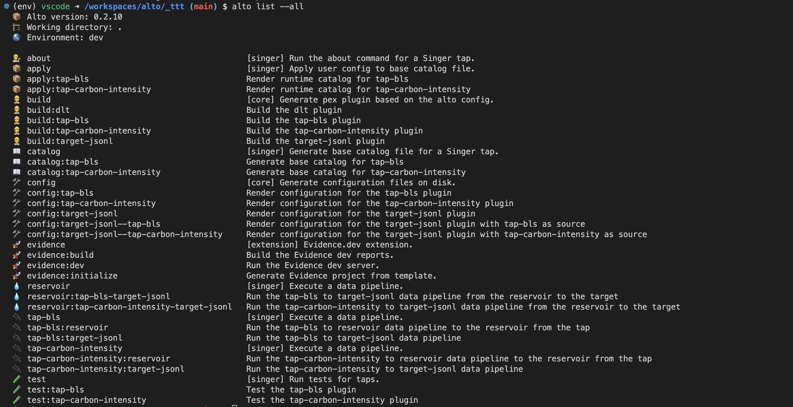
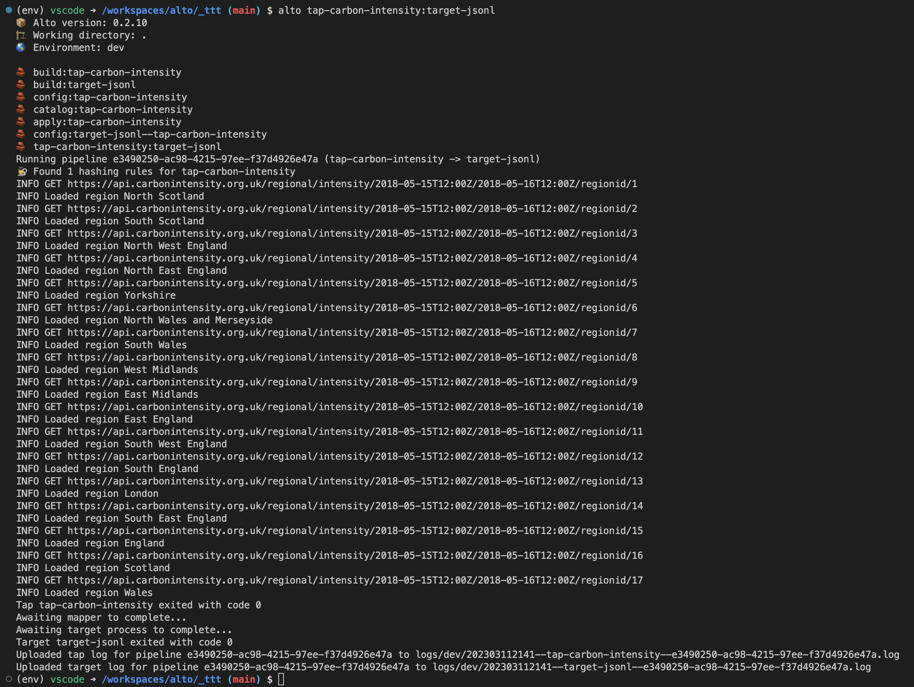

# Alto Quickstart

Let's run our first pipeline with **Alto in 2 minutes**.

## Getting Started

Get started by **creating a new alto project**.


### What you'll need

- [Python 3.8+](https://www.python.org/downloads/)
- [pipx](https://pipxproject.github.io/pipx/installation/) (optional, you can use `pip` instead)

## Generate a new project

Generate a ready-to-run starter project:

```bash
pipx install singer-alto
alto init
```

You can type this command into Command Prompt, Powershell, Terminal, or any other integrated terminal of your code editor. You will be prompted for your preferred configuration format (`toml`, `yaml`, or `json`) as well as a project name. This name is used to determine where your cached PEX files, catalogs, state, and data reservoir are materialized.

## List the available tasks

If your configuration were empty, you would see the following running `alto list`:


These are what are called **top-level tasks**. Each of these tasks has **subtasks** based on your `alto.{yaml,toml,json}` configuration file. It is the subtasks that actually do the work.

Running the `alto list --all` command in the default starter project will show you something like this:



As you can see, the default project has a _lot_ of tasks scaffolded right off the bat! Remember, all of these tasks are derived entirely from your configuration. We will dive deeper into configuration later, but do take a glance at the config file in your project when your ready.

Now that we have verified your project is ready to go, lets run a data pipeline (wait, already?!).

## Run a data pipeline

Run a data pipeline from `tap-carbon-intensity` to `target-jsonl`:

```bash
alto tap-carbon-intensity:target-jsonl
```

Remember, because `alto` is scaffolded over doit which is a Make-like task runner -- you can simply run the pipeline immediately. When this is invoked, alto will figure out that it needs to:

- Look for a cached PEX file for the current tap.
  - Create the PEX if it does not exists for the tap, cache it.
- Generate environment aware configuration in a temporary staging directory based on `alto.{toml,yaml,json}`.
- Check for the "base" catalog in the cache & copy it to the temporary staging directory.
  - Run discovery if the base catalog is not found, cache it.
- Apply user configuration from the `select` and `metadata` keys of the tap to the base catalog to generate a "runtime" catalog.
- Pull previous state from the cache if it exists.
- Look for a cached PEX file for the current target.
  - Create the PEX if it does not exists for the target, cache it.
- Check if there are any hashing rules or user defined stream maps.
- Run tap -> target, wiring in stream maps / PII hashing if configured.
- Parse target output and update the remote state.
  - Backup previous state before updating.
- Save logs & clean up.



All of this is completely transparent to the user. Given you ran the above command, **_congratulations_** on running your first pipeline in `alto` 👩‍🎤! Feel free to run it again now that the PEX files are cached and get a feel for the snappiness of startup and the snappiness of the CLI. Otherwise, the other sections of the documentation will help you dive deeper into the configuration and how to get the most out of `alto`.

## Recap

It really was this easy to get started. Let's recap what we did:

```bash
pipx install singer-alto
alto init
alto tap-carbon-intensity:target-jsonl
```

The next section will give you more exposure to the flexibility of the configuration.
